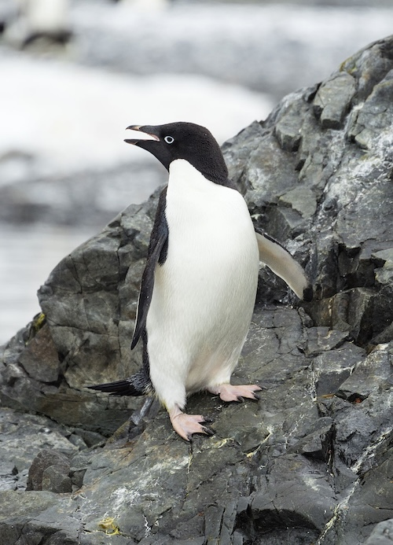

# Palmer Penguins

This week is looking at the `palmerpenguins` dataset. (I missed a few weeks.) 

I did some data viz looking at differences in physical features between penguins from different species and islands. 
Before we look at the data... here are the birds!

Adélie penguin!  
  
Chinstrap penguin!  
  
Gentoo penguin!  
  

Here is a peak at the data:  

```{r}
#| echo: false
#| message: false
#| warning: false
library(tidyverse)
library(ggplot2)
library(palmerpenguins)
library(scales)

# data(package = 'palmerpenguins')

knitr::kable(head(penguins))
```

Breaking down Species and Islands  
```{r}
#| echo: false
#| message: false
#| warning: false
penguins %>% group_by(island, species) %>% summarise(count = n()) %>% knitr::kable()
```


## Bills and Flippers  

```{r}
#| echo: false
#| message: false
#| warning: false
ggplot(penguins, aes(x = bill_length_mm, y = flipper_length_mm, color = species)) +
  geom_point() +
  labs(title = "Palmer Island Penguins: Bill and Flipper Length by Species",
       x = "Bill Length (mm)",
       y = "Flipper Length (mm)")
```

```{r}
#| echo: false
#| message: false
#| warning: false
ggplot(penguins, aes(x = bill_length_mm, y = flipper_length_mm, color = species)) +
  geom_point() +
  facet_wrap(vars(island)) +
  labs(title = "Palmer Island Penguins: Bill and Flipper Length by Species and Island",
       x = "Bill Length (mm)",
       y = "Flipper Length (mm)")
```

## Adélie Penguins Across Islands  
Adélie penguins have similar features across islands.  


```{r}
#| echo: false
#| message: false
#| warning: false
penguins %>% 
  filter(species == "Adelie") %>% 
  ggplot(aes(x = bill_length_mm, y = flipper_length_mm, color = island)) +
  geom_point() + 
  geom_smooth(method='lm', formula= y~x, se = FALSE) +
  labs(title = "Palmer Island Penguins: Adélie Penguin Bill Dimensions by Islands \n(lines are basic linear fit)",
       x = "Bill Length (mm)",
       y = "Flipper Length (mm)")
  
```

## Penguin Body Mass 

Finally a look at the distribution of penguin weight across islands and species with medians for reference. Only Adélie birds were observed on all three islands. The mean weights are very similar, but the typical Adélie on Dream Island is a little bit smaller. 

```{r}
#| echo: false
#| message: false
#| warning: false
medians <- penguins %>% group_by(island, species) %>% summarise(median_body_mass = median(body_mass_g, na.rm = TRUE))

ggplot(penguins, aes(x = body_mass_g, color = species)) +
  geom_density() +
  facet_grid(vars(island)) +
  scale_x_continuous(labels = scales::comma) +
  scale_y_continuous(labels = scales::comma) +
  geom_vline(aes(xintercept = median_body_mass, color = species), medians, linetype="dashed") +
  labs(title = "Palmer Island Penguins: Comparing Body Mass across Species and Islands \n(dashed line is sub-group median)",
       x = "Body Mass (g)",
       y = "Density")
```


